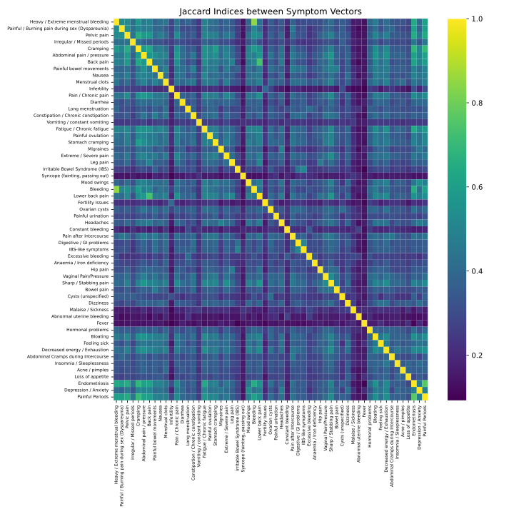
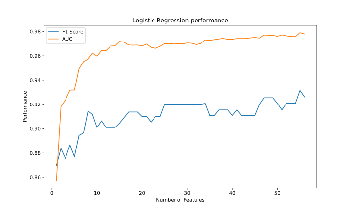
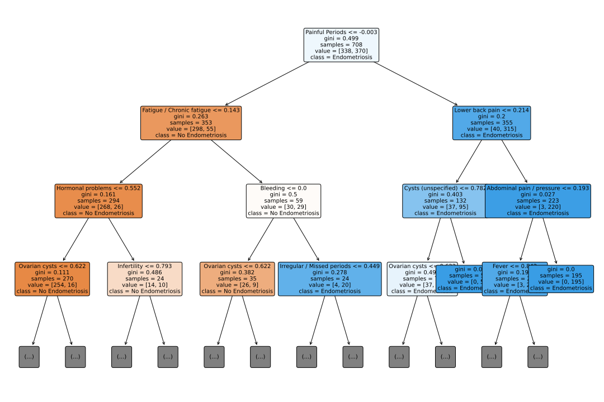
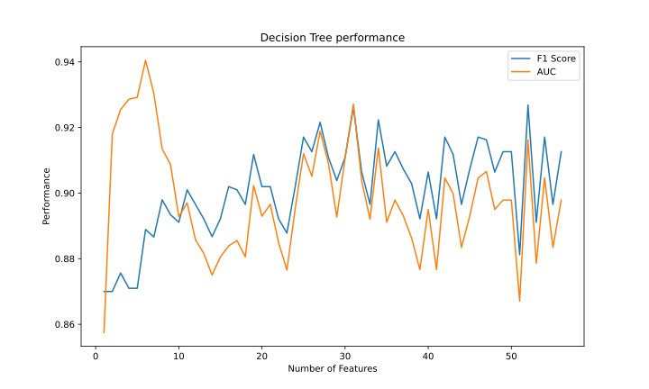
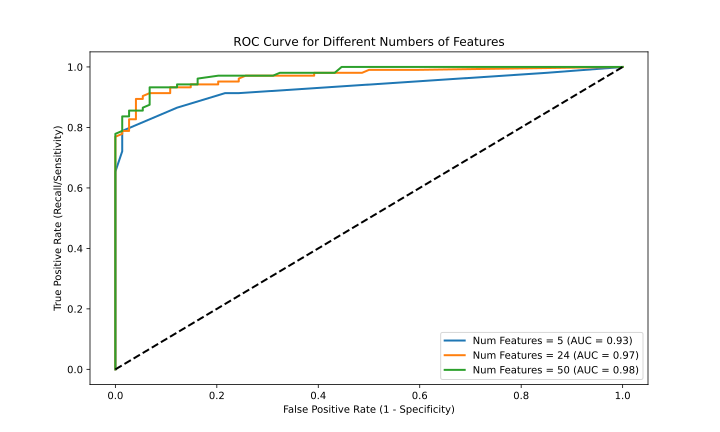
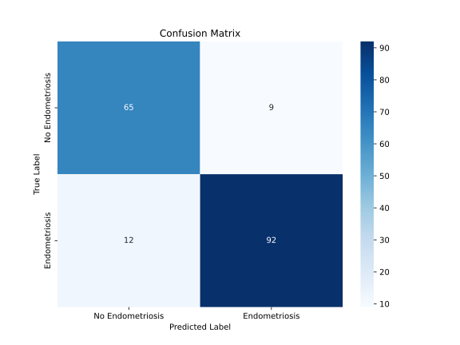

# endodetect-based-on-symptoms
This repository focuses on using machine learning (ML) to develop a self-diagnostic endometriosis tool based solely on patient-reported symptoms

## Table of Contents
1. [Introduction](#introduction)
2. [Machine Learning Algorithms](#machine-learning-algorithms)
   - [Logistic Regression](#logistic-regression)
   - [Decision Trees](#decision-trees)
   - [Random Forest](#random-forest)
3. [Dataset](#dataset)
5. [Installation](#installation)
7. [License](#license)

## Introduction
Current endometriosis diagnostic methods are invasive and expensive, prompting the need for non-invasive screening tools. Various studies have explored biomarkers, genomic data, and patient-reported symptoms, but none have been entirely successful in replacing laparoscopy. This project presented focuses on using machine learning
(ML) to develop a self-diagnostic tool based solely on patient-reported symptoms. The goal is to create an easy-to-use model for women in the early stages of medical investigation, providing a preliminary indication of their likelihood of having endometriosis. The study identifies a set of 24 symptoms most effective for endometriosis prediction, achieving high sensitivity (0.93) and specificity (0.93) on holdout data. The aim is to reduce the time-to-diagnosis and provide insights into the importance of different symptoms in predicting endometriosis.

## Dataset 

The dataset included 56 endometriosis symptoms that were compiled based on an extensive review of relevant literature. The dataset used in this project consists of 800 examples, each containing the symptoms related to endometriosis. It is a continuous dataset, and each entry is labeled with a binary response (0 or 1) indicating the presence or absence of the respective symptom.

### Feature Selection with Jaccard Index

To enhance the model's performance and avoid redundancy, we applied the Jaccard Index to the dataset. The Jaccard Index is a measure of similarity between two sets. In our context, it helps identify and eliminate redundant symptoms, ensuring a more concise and informative set of features. It is calculated as the size of the intersection of two sets divided by the size of their union. In the context of our dataset:

J(A, B) = |A ∩ B| / |A ∪ B|

- \(A\) represents the set of symptoms in one entry.
- \(B\) represents the set of symptoms in another entry.

A higher Jaccard Index indicates a higher degree of similarity between the sets. We used the Jaccard Index to iteratively evaluate different subsets of symptoms and determine the optimal number of informative features for our model.

### Jaccard Index Visualization

Below is a graph representing the Jaccard Index for various subsets of symptoms:



*Figure 1: Jaccard Index for Different Symptom Subsets*

In this representation, the ligther the color, the higher the similarity between 2 symptoms.

## Machine Learning Algorithms
We applied several ML algorithms to train multiple endometriosis prediction models. Specifically, we applied decision trees, Random Forest and Logistic Regression. Besides generating predictions, these models also provide an importance analysis feature, which can be used to identify and remove non-contributing features from future surveys. Model performance was evaluated using common ML metrics : accuracy, sensitivity (recall), specificity, precision, F1-score,area under the ROC curve (AUC) and Matthew Coorelation Coefficient. To ensure significance of the results, we used a ten-fold cross-validation procedure.

As discussed above, for each model type we also analyzed the effect of adding each symptom in the order of its importance based on the feature importance ranking derived from initial classification models (the models that were trained on the entire set of features

### Logistic Regression

Logistic regression is a straightforward and interpretable algorithm, well-suited for binary classification tasks. It provides probability estimates, enabling easy interpretation of feature impacts. However, its effectiveness may diminish in the presence of non-linear relationships or a large number of features.
Below is the F1 Score and the AUC for the logistic regression model:



*Figure 2: F1 Score and AUC*


| Metrics       | Mean    | Std        |
|---------------|---------|------------|
| Recall        | 0.9108  | 0.0437     |
| Specificity   | 0.9234  | 0.0591     |
| Precision     | 0.9318  | 0.0486     |
| F1-score      | 0.9196  | 0.0268     |
| Accuracy      | 0.9167  | 0.0291     |
| AUC           | 0.9171  | 0.0297     |


### Decision Trees

This is a simple, tree-structured classifier, where internal nodes represent the features of a dataset, branches represent the decision rules, and each leaf node represents the outcome (class). The tree structure (organization of nodes) is determined based on the importance of the nodes using an attribute selection measure, such as information gain or Gini index. The model’s simplicity is both its weakness and its strength: On the one hand, this model is limited in its capacity to capture complex relationships between variables, yet on the other hand, its classification process is simple to interpret.
This is a graphical representation of how decision trees work : 





Below is the F1 Score and the AUC for the decision trees:



*Figure 3: F1 Score and AUC*

| Metric      | Mean   | Std    |
|-------------|--------|--------|
| Recall      | 0.8919 | 0.0401 |
| Specificity | 0.8580 | 0.0672 |
| Precision   | 0.8763 | 0.0497 |
| F1-score    | 0.8827 | 0.0300 |
| Accuracy    | 0.8757 | 0.0339 |
| AUC         | 0.8750 | 0.0349 |

### Random Forest

This model generates a “forest” of decision trees, such that each tree is trained on a random subset of the features. The Random Forest model uses the entire collection of decision trees to classify a given sample, and eventually determines the classification output based on the trees’ majority vote, that is, the class that is the output of by most trees
Below is the F1 Score and the AUC for the random forest:


*Figure 4: F1 Score and AUC*

| Metric        | Mean   | Std       |
|---------------|--------|-----------|
| Recall        | 0.8946 | 0.0426    |
| Specificity   | 0.9350 | 0.0366    |
| Precision     | 0.9390 | 0.0319    |
| F1-score      | 0.9154 | 0.0258    |
| Accuracy      | 0.9138 | 0.0256    |


## Results 

With the obtained results, we chose to utilize the Random Forest model as it demonstrated slightly superior performance. By assessing feature importance, we aimed to refine the model by focusing on the most relevant variables, enhancing its interpretability, and potentially further improving predictive accuracy. We plotted the ROC Curve and the Confusion Matrix and calculated the AUC for various numbers of features.

 
*Figure 5: ROC curve*
 
*Figure 6: Confusion Matrix*

## Installation 

These instructions assume you have `git` installed for working with Github from command window.

1. Clone the repository, and navigate to the downloaded folder. Follow below commands.

```
git clone https://github.com/TristanLecourtois/endodetect-based-on-symptoms.git
cd endodetected-based-on-symptoms
```
2. Install few required pip packages, which are specified in the requirements.txt file.

```
pip3 install -r requirements.txt
```

## License 
The code in this project is licensed under the MIT license 2024 - Tristan Lecourtois.


